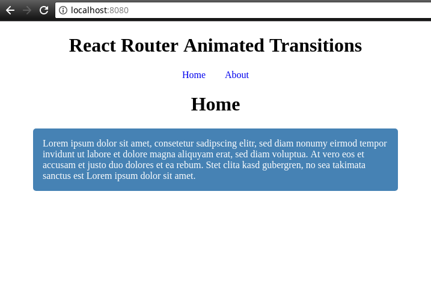

# Animated Transitions

## Installation

    $ git clone https://github.com/arkgast/react-router-transition-example
    $ cd react-router-transition-example
    $ npm install

## Usage

    $ npm start

